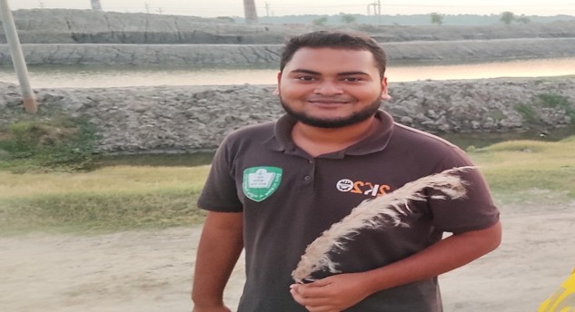
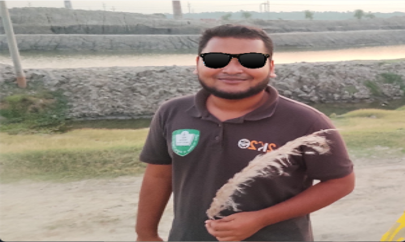
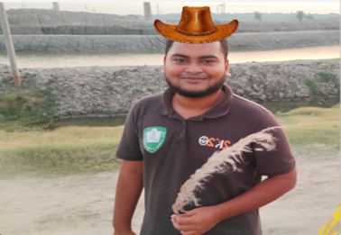
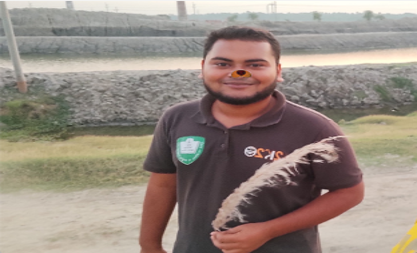

# Snapchat AR Filter Editor

A desktop application that applies **Snapchat-style Augmented Reality (AR) filters** to images using **classical computer vision techniques** instead of deep learning.

The system detects faces using **HSV skin-color segmentation**, locates **eye centers**, estimates **face orientation**, and overlays **pose-aware filters** such as sunglasses, hat, nose, mustache, and dog mask.

This project was developed for the **Image Processing and Computer Vision Laboratory** course.

---

# Features

* Face detection using **HSV skin-color segmentation**
* Eye detection using **Hough Circle Transform**
* Pose estimation using **eye alignment**
* AR filter placement with:

  * automatic **scaling**
  * **rotation-aware overlay**
  * **alpha blending**
* Interactive **Tkinter GUI**
* Multiple filter options
* Image **load, reset, and save**

---

# Methodology

```
Input Image
     │
     ▼
Convert BGR → HSV
     │
     ▼
Skin Color Thresholding
     │
     ▼
Morphological Filtering
     │
     ▼
Largest Contour → Face Region
     │
     ▼
Eye Detection (Hough Circles)
     │
     ▼
Compute Eye Midpoint & Angle
     │
     ▼
Resize + Rotate AR Filter
     │
     ▼
Alpha Blending Overlay
     │
     ▼
Final Output Image
```

---

# Face Detection

Face detection is performed using **skin-color segmentation in HSV color space**.

**Threshold values**

```
Lower bound: [0, 48, 80]
Upper bound: [20, 255, 255]
```

Steps:

1. Convert BGR image → HSV
2. Apply skin-color threshold
3. Remove noise using morphological operations
4. Detect contours
5. Select **largest contour as face region**

---

# Eye Detection

Eye detection is performed using **Hough Circle Transform**.

Steps:

1. Extract **top half of the detected face**
2. Apply:

   * histogram equalization
   * median blur
3. Detect circular features using **HoughCircles**

Parameters:

```
dp = 1
minDist = face_width / 4
param1 = 100
param2 = 5
minRadius = 2% of face width
maxRadius = 15% of face width
```

---

# AR Filter Placement

Filters are positioned using geometric calculations.

### Eye Midpoint

```
((left_x + right_x)/2 , (left_y + right_y)/2)
```

### Face Angle

```
angle = -atan2(dy, dx)
```

### Inter-eye Distance

```
distance = √(dx² + dy²)
```

Filters are then:

* **scaled** according to face width
* **rotated** based on face angle
* **placed** using trigonometric offsets

---

# Technologies Used

* Python
* OpenCV
* NumPy
* Tkinter
* PIL (Pillow)

---

# Project Structure

```
Snapchat-AR-Filter-Editor
│
├── main.py
├── filters
│   ├── glasses.png
│   ├── hat.png
│   ├── nosefilter2.png
│   ├── mustache.png
│   └── dog.png
│
├── README.md
└── presentation.pptx
```

---

# Installation

Clone the repository

```bash
git clone https://github.com/yourusername/snapchat-ar-filter-editor.git
```

Go to project directory

```bash
cd snapchat-ar-filter-editor
```

Install dependencies

```bash
pip install opencv-python pillow numpy
```

Run the application

```bash
python main.py
```

---

# How to Use

1. Run the application
2. Click **Load Image**
3. Select a photo
4. Choose a filter
5. Save the result if needed

Available Filters:

* Sunglasses
* Hat
* Nose
* Mustache
* Dog Face

---
# Results

Below are some example outputs from the **Snapchat AR Filter Editor**.

## Original Image



---

## Sunglasses Filter



---

## Hat Filter



---

## Nose Filter



---

## Mustache Filter


---


# Example Comparison

| Original                  | Filter Applied              |
| ------------------------- | --------------------------- |
|  |  |

# Limitations

* Skin-color segmentation may fail when:

  * background contains similar skin tones
  * lighting conditions vary significantly
* Works best with **frontal faces**

---

# Future Improvements

* Real-time **webcam filters**
* Deep learning based **face landmark detection**
* More AR filters
* Better lighting robustness

---

# Author

**Md. Raihan Hossain Rakib**
Department of Computer Science and Engineering
Khulna University of Engineering & Technology

Course:
Image Processing and Computer Vision Laboratory
